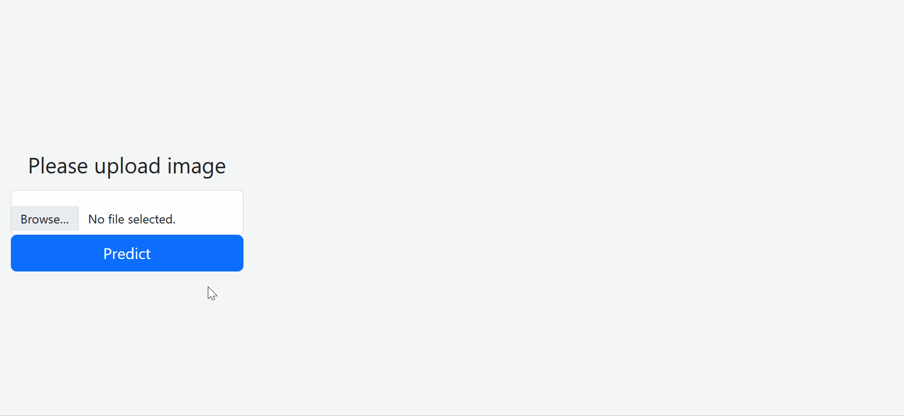

# Image Classification on Dogs and Cats Dataset

In this project, I have used Amazon Sagemaker to train and deploy a resnet-50 model proposed by __Kaiming He et. al__,  on  Dogs and Cats dataset from kaggle. Link to the dataset:- https://www.kaggle.com/competitions/dogs-vs-cats/data

Pytorch is used for modeling purpose.

## Follow the steps as below.
1. Create a Sagemaker notebook instance with the instance type as `ml.t2.medium`
2. Once the Notebook instance is `In Service`, clone this git repo in the Jupyter environment
3. Run `notebooks/02-Estimator-resnet50.ipynb` notebook to train and deploy the model with Amazon Sagemaker followed by Inference
4. Refer to `src/train.py` script used for training the model
5. Run notebook `notebooks/03-Create-Lambda` to create AWS Lambda required to host the Sagemaker Endpoint via API Gateway
6. Follow this detailed <a href = "https://aws.amazon.com/blogs/machine-learning/call-an-amazon-sagemaker-model-endpoint-using-amazon-api-gateway-and-aws-lambda/">AWS tutorial </a> to invoke lambda function via Amazon API gateway
7. Download `flask-app` folder in your local and run `flask-app/app.py` to create a flask API.
8. (Optional) You can follow this <a href = "https://medium.com/techfront/step-by-step-visual-guide-on-deploying-a-flask-application-on-aws-ec2-8e3e8b82c4f7">medium article</a> to run your Flask API on AWS EC2 instance.

## Demo

## Authors

- [@Ravishukla1234](https://www.github.com/Ravishukla1234)

